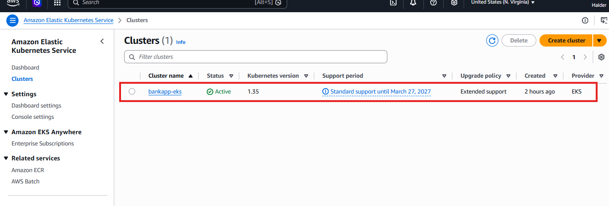
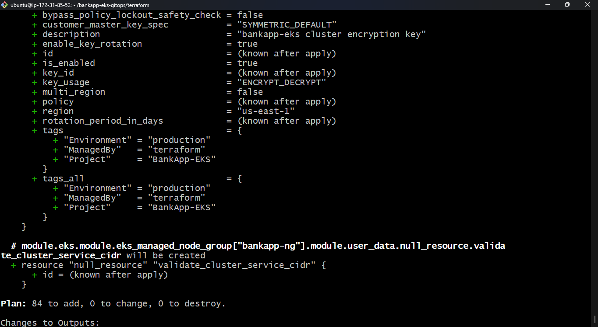
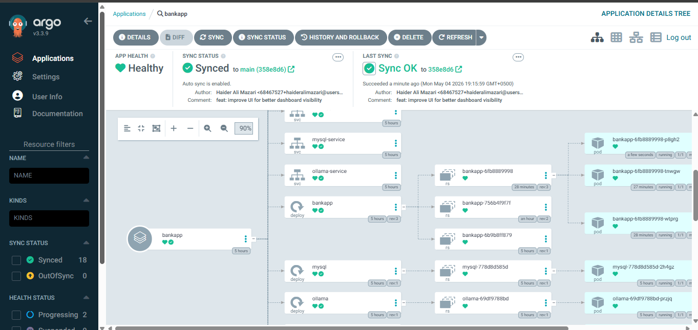
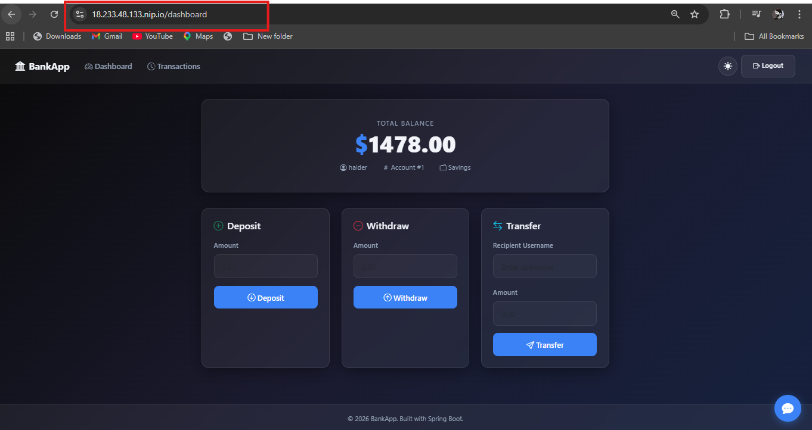
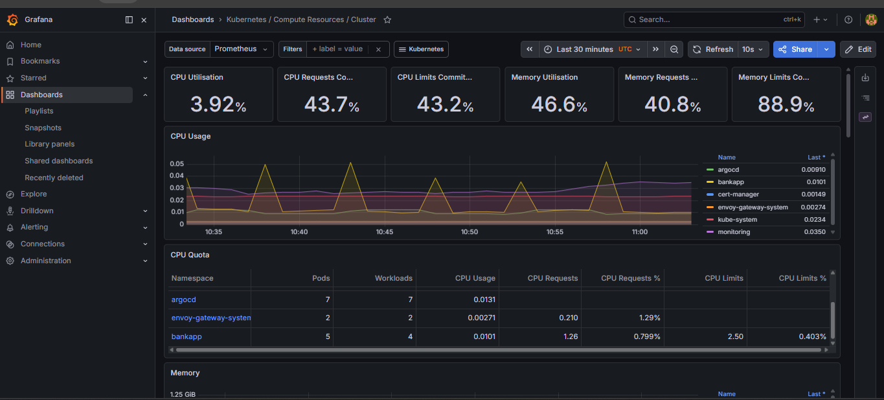

<div align="center">

# 🏦 BankApp EKS — GitOps on AWS

**Production-grade Banking Application with AI Integration, deployed on Amazon EKS using a complete GitOps pipeline.**

[](https://aws.amazon.com/eks/)
[](https://terraform.io)
[](https://argoproj.github.io)
[](https://spring.io)
[](https://prometheus.io)
[](https://grafana.com)

---

*A fully automated, zero-touch deployment pipeline featuring a Java Spring Boot banking app with a self-hosted TinyLlama AI chatbot, secured with TLS, monitored with Prometheus & Grafana, and managed through GitOps.*

</div>

---

## 📋 Table of Contents

- [Overview](#-overview)
- [Architecture](#-architecture--infrastructure)
- [Infrastructure as Code](#-infrastructure-as-code-terraform)
- [GitOps Pipeline](#-gitops--deployment-argocd)
- [Networking & Ingress](#-networking--ingress-gateway-api)
- [Live Application](#-live-application)
- [Monitoring & Observability](#-monitoring--observability)
- [Tech Stack](#-tech-stack)
- [Quick Start](#-quick-start)

---

## 🚀 Overview

This project demonstrates an **end-to-end DevOps lifecycle** for banking application. Every component — from cloud infrastructure to application deployment — is automated, version-controlled, and observable.

| Feature | Implementation |
|---|---|
| 🖥️ **Core App** | Java 21 + Spring Boot 3.4.1 with Glassmorphism UI |
| 🤖 **AI Integration** | Self-hosted TinyLlama via Ollama running on EKS |
| 🔄 **GitOps** | Fully automated deployments with ArgoCD auto-sync |
| 🔒 **Security** | Automated TLS via Cert-Manager + Let's Encrypt |
| 📈 **Scalability** | Custom HPA logic for traffic spike handling |
| 📊 **Observability** | Full Prometheus + Grafana + Node Exporter stack |
| 🏗️ **IaC** | 84 AWS resources provisioned via Terraform |

---

## 🏗️ Architecture & Infrastructure

### Cloud Infrastructure — AWS EKS

Managed EKS cluster running **Kubernetes 1.35** across **3 Availability Zones**, provisioned entirely through Terraform.


*Active `bankapp-eks` cluster on Kubernetes v1.35 — Standard support until March 2027*

---

## ⚙️ Infrastructure as Code (Terraform)

The entire AWS infrastructure is defined as code — VPC, subnets, EKS cluster, node groups, KMS encryption keys, IAM roles, and security groups. A single `terraform apply` provisions everything from scratch.

```hcl
module "eks" {
  source          = "terraform-aws-modules/eks/aws"
  cluster_name    = "bankapp-eks"
  cluster_version = "1.35"

  # KMS encryption for secrets at rest
  cluster_encryption_config = {
    provider_key_arn = module.kms.key_arn
    resources        = ["secrets"]
  }

  # Tags managed by Terraform
  tags = {
    Environment = "production"
    ManagedBy   = "terraform"
    Project     = "BankApp-EKS"
  }
}
```


*`terraform plan` output — 84 resources to add, including VPC, EKS cluster, managed node groups, and KMS encryption keys*

> **Key Terraform resources provisioned:**
> - `aws_eks_cluster` — Managed control plane with private API endpoint
> - `aws_kms_key` — Envelope encryption for Kubernetes secrets (`ENCRYPT_DECRYPT`)
> - `aws_vpc` + subnets — Isolated network across 3 AZs
> - `aws_eks_node_group` — Managed node group `bankapp-ng` with auto-scaling

---

## 🔄 GitOps & Deployment (ArgoCD)

This project follows a **Zero-Touch Deployment** strategy. Any commit pushed to the `main` branch is automatically detected and reconciled by ArgoCD — no manual `kubectl apply` ever needed.

```
Developer → git push → GitHub → ArgoCD detects diff → Auto-sync to EKS
```


*ArgoCD showing all 18 resources **Synced** and **Healthy** — bankapp, mysql, ollama deployments all running*

**ArgoCD Sync Status:**
- ✅ **App Health:** Healthy
- ✅ **Sync Status:** Synced to `main (358e8d6)`
- ✅ **Last Sync:** Succeeded — *"feat: improve UI for better dashboard visibility"*
- 🔁 **Auto sync:** Enabled

---

## 🌐 Networking & Ingress (Gateway API)

Instead of the traditional Nginx Ingress, this project uses the **modern Kubernetes Gateway API** with Envoy Gateway — the future standard for Kubernetes traffic management.

```
Internet → AWS NLB → Envoy Gateway → HTTPRoute → bankapp Service → Pods
```


*`kubectl get gatewayclass,gateway,httproute -A` — GatewayClass accepted, Gateway programmed, HTTPRoutes active*

**Networking highlights:**
- **Load Balancer:** AWS Network Load Balancer (NLB) — `ae60421e9a46c4647986bd338593c86c-90267515.us-east-1.elb.amazonaws.com`
- **Gateway Controller:** `gateway.envoyproxy.io/gatewayclass-controller`
- **Dynamic DNS:** nip.io for instant public access without custom domain setup
- **TLS/SSL:** Automated certificate issuance and renewal via Cert-Manager + Let's Encrypt

---

## 💻 Live Application

The BankApp is a modern banking dashboard built with Spring Boot, featuring real-time balance display, deposits, withdrawals, and peer-to-peer transfers — all backed by MySQL on Kubernetes.


*Live BankApp running at `https://18.233.48.133.nip.io/dashboard` — Glassmorphism UI with Deposit, Withdraw & Transfer*

**App features:**
- 💰 Real-time account balance display
- ➕ Deposit funds
- ➖ Withdraw funds
- 🔁 Transfer to other users
- 🤖 AI chatbot powered by self-hosted TinyLlama (Ollama)

---

## 📊 Monitoring & Observability

Full observability stack deployed inside the cluster — **Prometheus** scrapes metrics, **Grafana** visualizes them, and **Node Exporter** exposes host-level metrics.

### Cluster-Wide Resource Monitoring


*Grafana — Kubernetes Compute Resources / Cluster: CPU utilisation **3.92%**, Memory **46.6%**, across argocd, bankapp, envoy-gateway namespaces*

### Application Workload Monitoring


*Grafana — Namespace (bankapp): Per-workload CPU/Memory quotas for `bankapp`, `mysql`, `ollama`, and `bankapp-tls` challenge pods*

| Workload | Pods | CPU Usage | CPU Requests | Memory |
|---|---|---|---|---|
| `bankapp` | 2 | 0.0138 | 0.500 | 506 MiB |
| `ollama` | 1 | 0.00192 | 0.500 | — |
| `mysql` | 1 | 0.00476 | 0.250 | — |

### Node-Level Metrics (Node Exporter)


*Node Exporter dashboard — CPU Usage near **0%** idle, Memory at **52.4%** used, Load Average stable across 1m/5m/15m*

---

## 🛠️ Tech Stack

| Layer | Tools |
|---|---|
| ☁️ **Cloud** | AWS (EKS, VPC, EBS, ELB, KMS, IAM) |
| 🏗️ **Automation** | Terraform, GitHub Actions, ArgoCD |
| 🌐 **Networking** | Gateway API, Envoy Proxy, Cert-Manager, Let's Encrypt |
| 📦 **App Stack** | Java 21, Spring Boot 3.4.1, MySQL 8 |
| 🤖 **AI/LLM** | Ollama, TinyLlama |
| 📊 **Monitoring** | Prometheus, Grafana, Node Exporter, kube-state-metrics |
| 🐳 **Container** | Docker, Kubernetes 1.35 |

---

## ⚡ Quick Start

### Prerequisites
- AWS CLI configured with appropriate permissions
- Terraform ≥ 1.5
- kubectl
- ArgoCD CLI (optional)

### 1. Clone the Repository

```bash
git clone https://github.com/your-username/bankapp-eks-gitops
cd bankapp-eks-gitops
```

### 2. Provision AWS Infrastructure

```bash
cd terraform
terraform init
terraform plan    # Review: 84 resources to add
terraform apply   # ~20 minutes
```

### 3. Connect to the EKS Cluster

```bash
aws eks update-kubeconfig \
  --region us-east-1 \
  --name bankapp-eks
```

### 4. Deploy via ArgoCD

```bash
kubectl apply -f argocd/application.yml
# ArgoCD will auto-sync and deploy all workloads
```

### 5. Verify Deployment

```bash
# Check all resources
kubectl get gatewayclass,gateway,httproute -A

# Check pods
kubectl get pods -n bankapp

# Access Grafana
kubectl port-forward svc/grafana 3000:3000 -n monitoring
```

---

## 📁 Project Structure

```
bankapp-eks-gitops/
├── terraform/          # AWS infrastructure (EKS, VPC, KMS, IAM)
├── k8s/
│   ├── bankapp/        # Spring Boot app manifests
│   ├── mysql/          # StatefulSet + PVC
│   ├── ollama/         # TinyLlama deployment
│   ├── gateway/        # Gateway API, HTTPRoutes
│   ├── cert-manager/   # ClusterIssuer, Certificates
│   └── monitoring/     # Prometheus, Grafana, Node Exporter
├── argocd/
│   └── application.yml # ArgoCD Application manifest
└── app/                # Spring Boot source code
```

---

<div align="center">

*Java 21 · Spring Boot · AWS EKS · Terraform · ArgoCD · Prometheus · Grafana*

</div>
